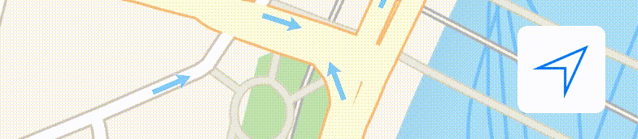

**NOTE: iOS 11 added MKUserTrackingButton that does exactly what this project is intended to be and should be preferred over this.**

# UserTrackingButton

A replacement for `MKUserTrackingBarButtonItem` when you don't have toolbars or navigation bars.



UserTrackingButton is a button that works in conjunction with `MKMapView`. Unlike `MKUserTrackingBarButtonItem` it can be used even when you don't have toolbars or navigation bars.
 
## Installation

#### Carthage

Add `github "mkko/UserTrackingButton" ~> 0.3.1` to you `Cartfile`. Follow the further instrcutions on [Carthage getting started][1] page.

*NB: There is a bug with `@IBDesignable` when using external frameworks that prevents the view from rendering wihtin Interface Builder. Further reading can be found [here][2].*

#### CocoaPods

Add `pod 'UserTrackingButton', '~> 0.3.1'` to you `Podfile` and run `pod install`.

## Setup

To use UserTrackingButton from Interface Builder simply subclass a `UIView` component and set its class to UserTrackingButton. Then connect the `mapView` outlet and remember to update the button in `MKMapViewDelegate` methods:

```
extension ViewController: MKMapViewDelegate {
    
    func mapView(mapView: MKMapView, didUpdateUserLocation userLocation: MKUserLocation) {
        userTrackingButton.updateStateAnimated(true)
    }
    
    func mapView(mapView: MKMapView, didChangeUserTrackingMode mode: MKUserTrackingMode, animated: Bool) {
        userTrackingButton.updateStateAnimated(true)
    }
}
```

The manual updating is a minor inconvenience as the `MKMapView` instance can only have one delegate. However, if you're using RxSwift, there's a [wrapper][3] to make this easier:

```
        Observable.combineLatest(mapView.rx_didUpdateUserLocation, mapView.rx_didChangeUserTrackingMode) { return ($0, $1) }
            .subscribe { _ in self.userTrackingButton.updateState(true) }
            /* Also this, if you're using: */ .addDisposableTo(disposeBag)
```

When creating the button programmatically the same steps are required:
```
let btn = UserTrackingButton(frame: trackingButtonFrame)
btn.mapView = self.mapView
self.view.addSubview(btn)
```

[1]: https://github.com/Carthage/Carthage#if-youre-building-for-ios
[2]: https://openradar.appspot.com/23114017
[3]: https://github.com/RxSwiftCommunity/RxMKMapView
